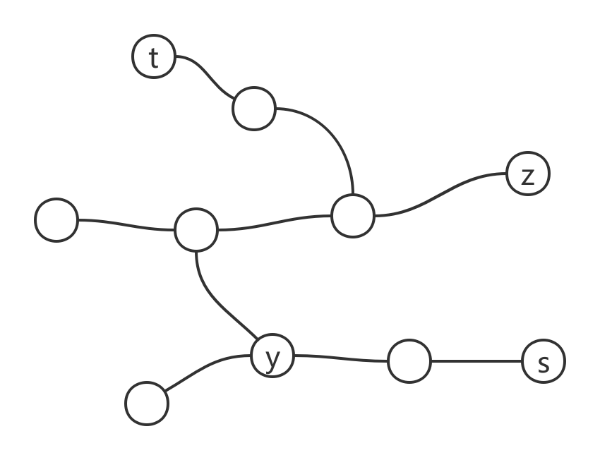
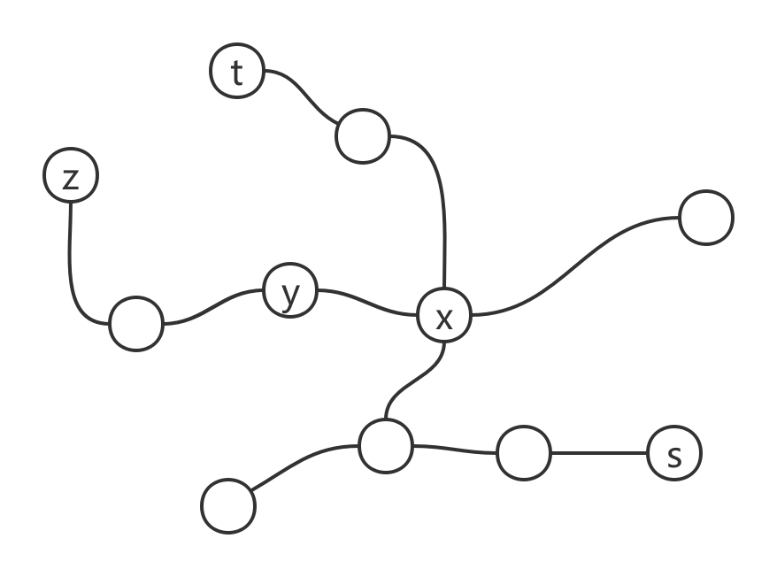

> *题目原链接：[1245. 树的直径](https://leetcode-cn.com/contest/biweekly-contest-12/problems/tree-diameter)*

### 题目

给你这棵「无向树」，请你测算并返回它的「直径」：这棵树上最长简单路径的 **边数** 。

我们用一个由所有「边」组成的数组 `edges` 来表示一棵无向树，其中 `edges[i] = [u, v]` 表示节点 `u` 和 `v`
之间的双向边。

树上的节点都已经用 `{0, 1, ..., edges.length}` 中的数做了标记，每个节点上的标记都是独一无二的。

**示例 1：**


```
输入：edges = [[0,1],[0,2]]
输出：2
解释：
这棵树上最长的路径是 1 - 0 - 2，边数为 2。
```

**示例 2：**


```
输入：edges = [[0,1],[1,2],[2,3],[1,4],[4,5]]
输出：4
解释：
这棵树上最长的路径是 3 - 2 - 1 - 4 - 5，边数为 4。
```

**提示：**

* `0 <= edges.length < 10^4`
* `edges[i][0] != edges[i][1]`
* `0 <= edges[i][j] <= edges.length`
* `edges` 会形成一棵无向树

### 解析

树的直径的解法，两次 BFS：

1. 任取一点 BFS，选择最长路径的节点，假设这个点为 `a`。
2. 从 `a` 开始 BFS，最长路径就是树的直径。

下面来证明这个定理。

**定理：** 在一个连通无向无环图中，以任意结点出发所能到达的最远结点，一定是该图直径的端点之一。

<div>
    
</div>

**证明：** 假设这条直径是 `δ(s,t)`。分两种情况：

1. 当出发结点 `y` 在 `δ(s,t)` 时，假设到达的最远结点 `z` 不是 `s`, `t` 中的任一个。这时将 `δ(y,z)` 与不与之重合的 `δ(y,s)` 拼接（也可以假设不与之重合的是直径的另一个方向），可以得到一条更长的直径，与前提矛盾，如图 1 所示。
2. 当出发结点 `y` 不在 `δ(s,t)` 上时，分两种情况：
    - 当 `y` 到达的最远结点 `z` 横穿 `δ(s,t)` 时，记与之相交的结点为 `x`。此时有 `δ(y,z) = δ(y,x) + δ(x,z)`。而此时 `δ(y,z) > δ(y,t)`，故可得 `δ(x,z) > δ(x,t)`。由 1 的结论可知该假设不成立，如图 2 所示。
    - 当 `y` 到达的最远结点 `z` 与 `δ(s,t)` 不相交时，记 `y` 到 `t` 的最短路首先与 `δ(s,t)` 相交的结点是 `x`。由假设 `δ(y,z) > δ(y,x) + δ(x,t)`。而 `δ(y,z) + δ(y,x) + δ(x,s)` 又可以形成 `δ(z,s)`，而 `δ(z,s) > δ(x,s) + δ(x,t) + 2 * δ(y,x) = δ(s,t) + 2 * δ(y,x)`，显然与题意矛盾，如图 3 所示。

### 代码

```cpp
class Solution {
public:
    pair<int, int> treeBFS(vector<vector<int>> e, int start) {
        vector<int> distance(e.size(), -1);
        distance[start] = 0;
        
        queue<int> Queue;
        Queue.push(start);
        
        pair<int, int> ans;
        while (!Queue.empty()) {
            int node = Queue.front();
            Queue.pop();
            ans.first = node;
            ans.second = distance[node];
            for (auto x: e[node]) {
                if (distance[x] == -1) {
                    distance[x] = distance[node] + 1;
                    Queue.push(x);
                }
            }
        }
        
        return ans;
    }
    
    int treeDiameter(vector<vector<int>>& edges) {
        int n = edges.size() + 1;
        vector<vector<int>> e(n, vector<int>());
        
        for (auto edge: edges) {
            e[edge[0]].push_back(edge[1]);
            e[edge[1]].push_back(edge[0]);
        }
        
        pair<int, int> node;
        node = treeBFS(e, 0);
        node = treeBFS(e, node.first);
        
        return node.second;
    }
};
```